# Pubblicare un progetto p5js su GitHub Pages

L'editor online di [p5js](https://editor.p5js.org/) è uno strumento formidabile per creare dei progetti creativi in JavaScript, eseguiti nel proprio browser. A volte vorremmo poter pubblicare il progetto come una pagina web indipendente, in questo caso ci può venire in aiuto GitHub con la sua funzionalità di GitHub Pages, che fornisce hosting gratuito per il progetti pubblici.

## Prerequisiti
Per questo tutorial dovete avere:
- [VSCode](https://code.visualstudio.com/) installato sulla propria macchina
- [git](https://git-scm.com/downloads) installato sulla propria macchina
- un account su [GitHub](https://github.com/)


## Istruzioni

Per pubblicare il proprio progetto su GitHub pages seguire i seguenti passi:
- andare su [p5js](https://editor.p5js.org/), fare il login ed aprire il proprio progetto foresta; se non si ha un proprio progetto, potete usare il [mio progetto](https://editor.p5js.org/claudio.capobianco/sketches/O4km37Gd6)
- andare su File->Download
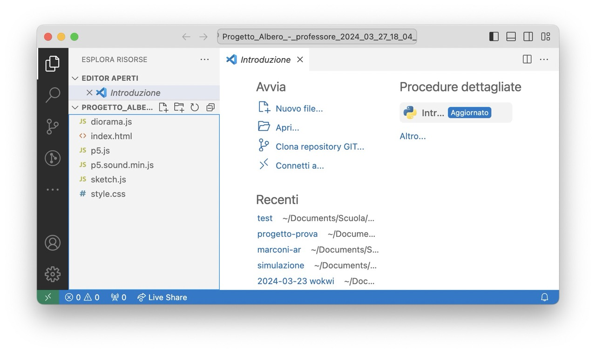
- scompattare il file scaricato (su Windows premere tasto destra -> estrai tutto)
- aprire VS Code, fare il login con il proprio account GitHub
- aprire la cartella appena scompattata
- andare su "Controllo del codice sorgente" nella barra a sinistra
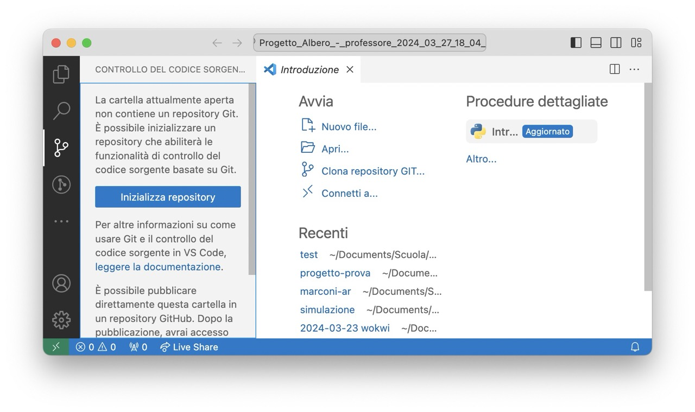
- cliccare su Inizializza repository, quindi sull'iconcina del `+` ("Prepara tutte le modifiche per commit")
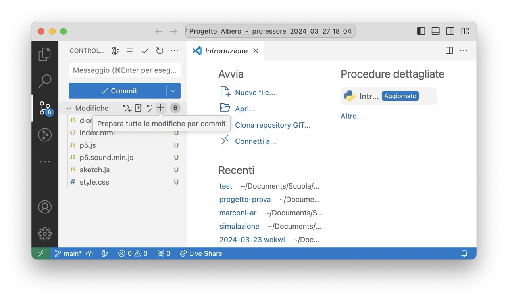
- aggiungere un commento (ad esempio `Primo commit`), quindi premere su "Commit"
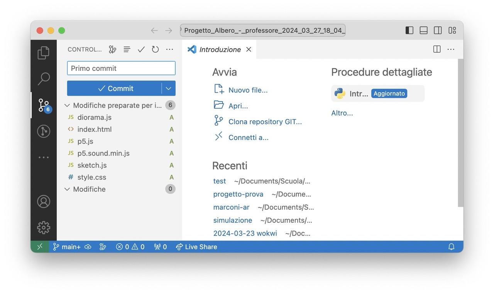
- se dovesse dare un errore, probabilmente non avete ancora configurato `git` sul vostro computer; per farlo, aprire un terminale cliccando sull'icona del pannello inferiore in alto a destra, quindi nel terminale scrivere

```bash
git config --global user.name "your name"
git config --global user.email "your_email@example.com"
```

- cliccare su Pubblica Branch
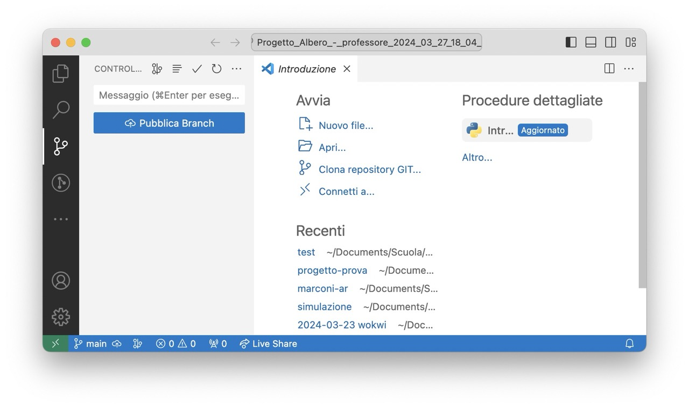
- selezionare `Publish to GitHub public repository`
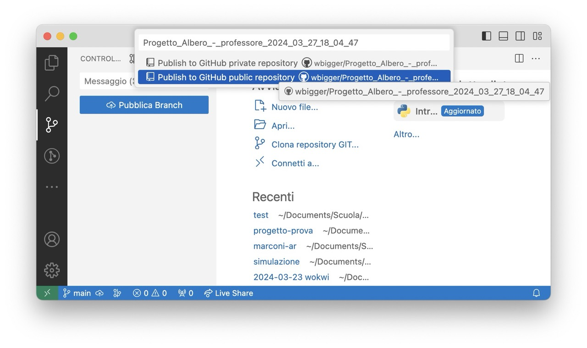
- cliccare sul tasto "Apri in GitHub"; in caso vi perdeste la finestra, basta che tornate su [GitHub](https://github.com/wbigger?tab=repositories)
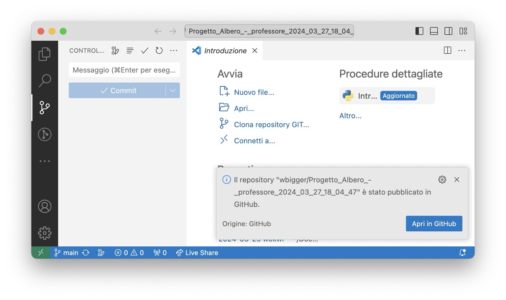
- dal browser, cliccate in alto a destra su Settings
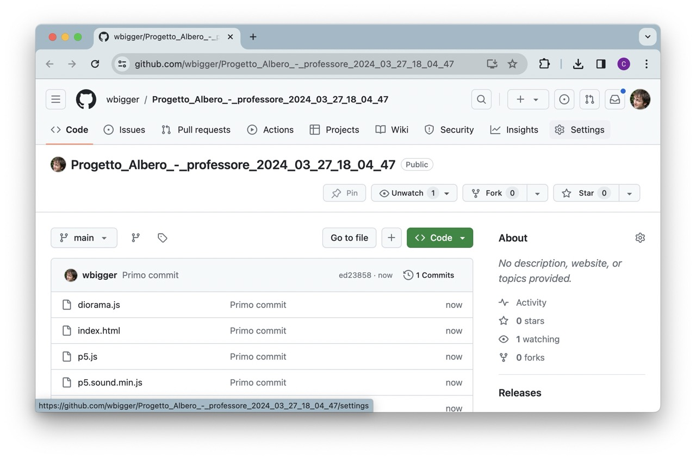
- dalla barra a sinistra, cliccate su Pages, nella sezione Branch, selezionate `main` e quindi premete `Save`
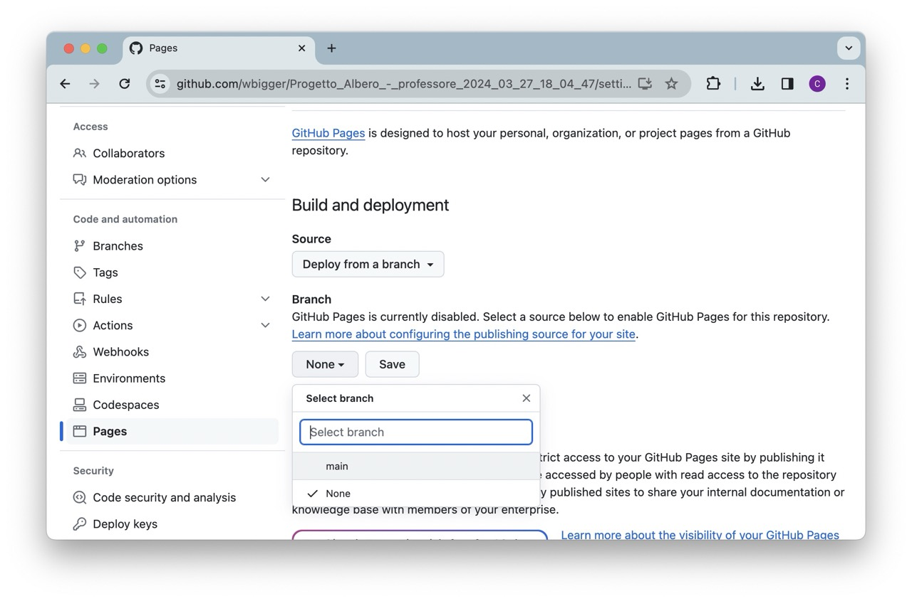
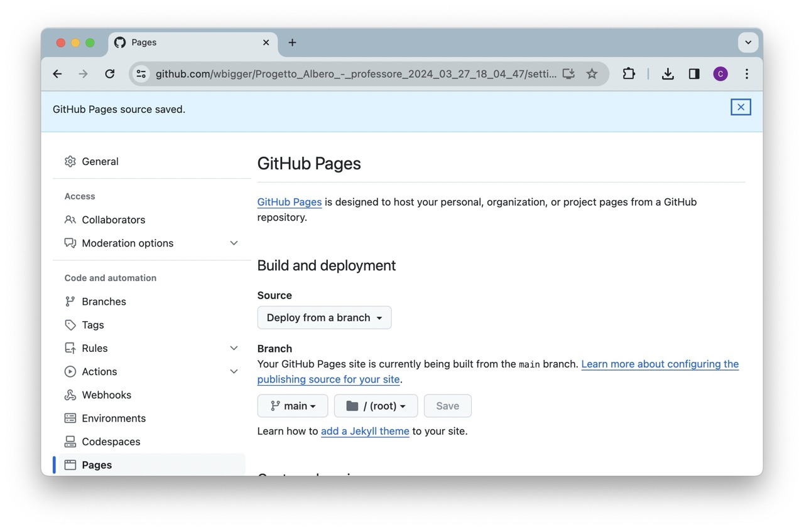
- aspettate circa 30 secondi, quindi aggiornate la pagina, vi comparirà il link al vostro progetto pubblicato
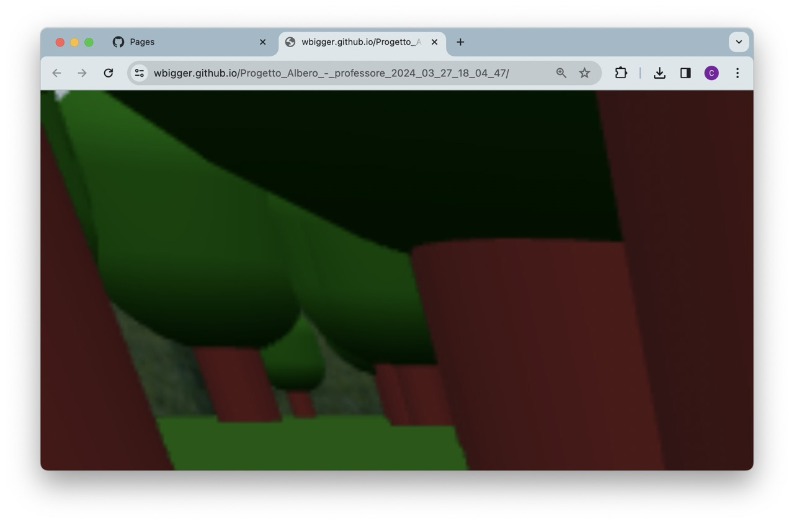


Bene, abbiamo il progetto pubblicato! Ancora non è perfetto e dovremo fare qualche modifica, ma il procedimento di base è completo.


